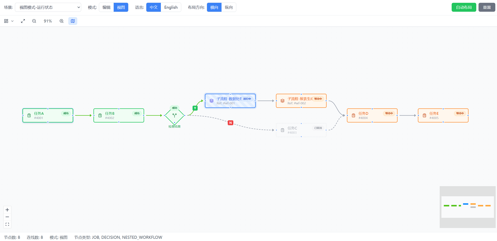

<h1 align="center">power-workflow-next</h1>

<p align="center">
  <a href="./README.md">English</a> | <a href="./README.zh-CN.md">简体中文</a>
</p>

<p align="center">
  
  
  
  
  
  
  
  
  
</p>

<p align="center">A PowerJob workflow visualization component based on React Flow, designed to replace the legacy @antv/g6-based workflow editor.</p>


<p align="center">
  
</p>

## Features

- **Three Node Types**: Task node (JOB), Decision node (DECISION), Nested workflow node (NESTED_WORKFLOW)
- **Canvas Capabilities**: Drag nodes, connect edges, edit/view mode toggle, zoom limits (25%–200%), connection snap direction (horizontal/vertical)
- **Edge Styles**: Basic gray edges, branch edges (true/false green/red + Y/N labels), selection highlight
- **Edit Panel**: Right-side slide-in panel, form validation, save confirmation
- **Auto Layout**: Dagre hierarchical layout, supports horizontal/vertical orientation
- **Undo/Redo**: Configurable history steps (default 50 steps)
- **Context Menu**: Add nodes, copy/paste
- **Keyboard Shortcuts**: Delete, Ctrl+Z/Y, Ctrl+C/V, Ctrl+A, Ctrl+D, Escape
- **View Mode**: Node status display, running animation, execution details tooltip
- **Enhanced Features**: Minimap navigation, node search/filter, optional embedded toolbar
- **Internationalization**: Chinese/English (zh-CN / en-US), defaults to Chinese

## Installation

```bash
npm install power-workflow-next
```

## Quick Start

```tsx
import {
  WorkflowCanvas,
  useWorkflowStore,
  layoutNodes,
  NodeType,
  NodeStatus,
} from 'power-workflow-next';
import 'power-workflow-next/style.css';

const initialNodes = [
  {
    id: '1',
    type: 'JOB',
    position: { x: 0, y: 0 },
    data: {
      label: 'Data Cleaning Task',
      type: NodeType.JOB,
      jobId: 1001,
      enable: true,
    },
  },
];

const initialEdges = [];

function App() {
  const { nodes, edges, setNodes, setEdges } = useWorkflowStore();

  return (
    <div className="w-full h-screen">
      <WorkflowCanvas nodes={nodes} edges={edges} mode="edit" defaultLocale="en-US" />
    </div>
  );
}
```

## API Documentation

### WorkflowCanvas Props

The component accepts `WorkflowNextProps`, inheriting common React Flow canvas capabilities:

| Property                 | Type                     | Default    | Description                   |
| ------------------------ | ------------------------ | ---------- | ----------------------------- |
| `nodes`                  | `WorkflowNode[]`         | `[]`       | Node data                     |
| `edges`                  | `WorkflowEdge[]`         | `[]`       | Edge data                     |
| `mode`                   | `'edit' \| 'view'`       | `'edit'`   | Edit/view mode                |
| `defaultLocale`          | `'zh-CN' \| 'en-US'`    | `'zh-CN'`  | Default language              |
| `onNodesChange`          | `function`               | -          | Node change callback          |
| `onEdgesChange`          | `function`               | -          | Edge change callback          |
| `onConnect`              | `function`               | -          | Connection callback           |
| `onNodeDataChange`       | `function`               | -          | Node data change callback     |
| `onValidationError`      | `(errors: unknown[]) => void` | -   | Validation error callback     |
| `connectSnapDirection`   | `'horizontal' \| 'vertical'` | -     | Connection snap direction     |
| `showToolbar`            | `boolean`                | -          | Show toolbar above canvas     |
| `jobOptions`             | `WorkflowReferenceOption[]` | -      | Job dropdown options (edit panel) |
| `workflowOptions`        | `WorkflowReferenceOption[]` | -     | Workflow dropdown options (nested node) |
| `onAutoLayout`           | `function`               | -          | Auto layout callback          |
| `onAddNode`              | `function`               | -          | Add node callback             |
| `onExport` / `onImport`  | `function`               | -          | Export/import callback        |
| `showMinimap` / `onToggleMinimap` | `boolean` / `function` | - | Minimap display and toggle    |
| `undoableActions`        | `number`                 | `50`       | Undo history limit            |

### Data Structures

#### WorkflowNodeData

```typescript
interface WorkflowNodeData {
  label: string;
  type: NodeType;
  status?: NodeStatus;
  instanceId?: string;
  execution?: ExecutionInfo;

  jobId?: string | number;
  enable?: boolean;
  skip?: boolean;
  timeout?: number;
  params?: string;
  condition?: string;
  targetWorkflowId?: string | number;

  /** Decision node execution result, only exists for DECISION nodes after running */
  result?: 'true' | 'false';
  /** Disabled by control node, only in view/run mode */
  disableByControlNode?: boolean;
}
```

#### NodeType

```typescript
enum NodeType {
  JOB = 'JOB',
  DECISION = 'DECISION',
  NESTED_WORKFLOW = 'NESTED_WORKFLOW',
}
```

#### NodeStatus

```typescript
enum NodeStatus {
  WAITING = 1,
  RUNNING = 3,
  FAILED = 4,
  SUCCESS = 5,
  CANCELED = 6,
  STOPPED = 10,
}
```

### Utility Functions

```typescript
import {
  layoutNodes,           // Dagre auto layout
  detectCycle,           // Cycle dependency detection
  checkDecisionNodeExits, // Decision node exit validation
  exportToJSON,          // Export to JSON
  importFromJSON,        // Import from JSON
  generateNodeId,        // Generate node ID
  generateEdgeId,        // Generate edge ID
  createDefaultNodeData, // Create default node data
  deepClone,             // Deep clone
} from 'power-workflow-next';

import {
  assignOptimalHandles,   // Assign optimal connection handles
  getOptimalHandlesForEdge,
  getSnapHandlesForEdge,
  normalizeConnectionDirection,
} from 'power-workflow-next';

// Auto layout
const newNodes = layoutNodes(nodes, edges, { direction: 'horizontal' });

// Cycle detection
const cycleError = detectCycle(nodes, edges);

// Export / Import
const json = exportToJSON(nodes, edges);
const { success, data, error } = importFromJSON(jsonString);
```

### Validators

```typescript
import {
  required,
  minLength,
  maxLength,
  range,
  pattern,
  json,
  condition,
  positiveInteger,
  nodeName,
  composeValidators,
  useValidators,
} from 'power-workflow-next';
```

## Project Structure

```
power-workflow-next/
├── src/
│   ├── components/
│   │   ├── WorkflowCanvas/   # Main canvas component
│   │   ├── nodes/            # Node components (JobNode, DecisionNode, NestedWorkflowNode)
│   │   ├── edges/            # Edge components
│   │   ├── panels/           # Edit panels and forms (EditorPanel, *Form, form controls)
│   │   ├── toolbar/          # Toolbar
│   │   └── common/           # Common components (minimap, tooltip, context menu, etc.)
│   ├── contexts/             # React contexts (LocaleContext)
│   ├── hooks/                # Custom hooks (shortcuts, search, i18n)
│   ├── stores/               # Zustand state management
│   ├── utils/                # Utility functions (layout, validation, workflow, edge handles)
│   ├── types/                # TypeScript types
│   ├── locales/              # Internationalization
│   └── styles/               # Style files
├── tests/
│   ├── setup.ts              # Test environment config
│   └── unit/                 # Unit tests
│       ├── components/       # Component tests (nodes, edges)
│       ├── stores/           # State management tests
│       └── utils/            # Utility function tests
├── playground/               # Local demo and debugging
├── docs/                     # Documentation and design notes
├── package.json
├── vite.config.ts
└── tsconfig.json
```

## License

Apache-2.0
